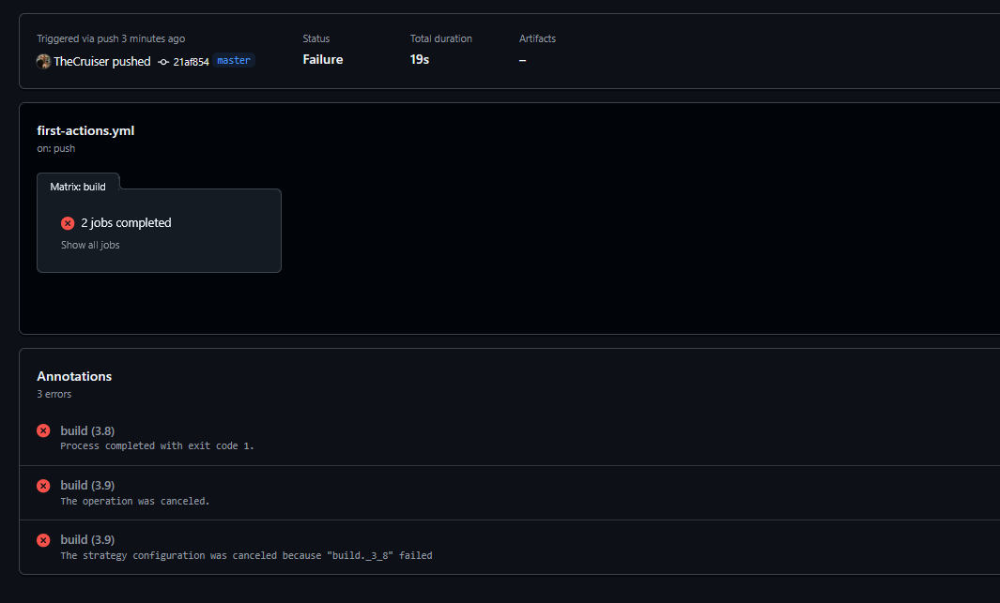
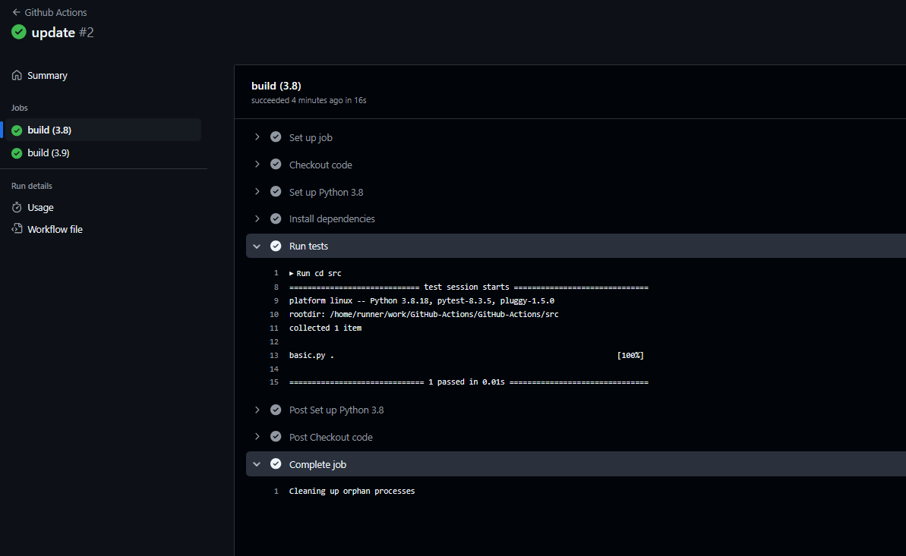

## GitHub Actions vs Jenkins vs GitLab CI
(Depends on Organization - Github Actions & Gitlab CI are platform oriented)

### Advantages of GitHub Actions over Jenkins

- Hosting: Jenkins is self-hosted, meaning it requires its own server to run, while GitHub Actions is hosted by GitHub and runs directly in your GitHub repository.

- User interface: Jenkins has a complex and sophisticated user interface, while GitHub Actions has a more streamlined and user-friendly interface that is better suited for simple to moderate automation tasks.

- Cost: Jenkins can be expensive to run and maintain, especially for organizations with large and complex automation needs. GitHub Actions, on the other hand, is free for open-source projects and has a tiered pricing model for private repositories, making it more accessible to smaller organizations and individual developers.

### Advantages of Jenkins over GitHub Actions

- Integration: Jenkins can integrate with a wide range of tools and services, but GitHub Actions is tightly integrated with the GitHub platform, making it easier to automate tasks related to your GitHub workflow.

In conclusion, Jenkins is better suited for complex and large-scale automation tasks, while GitHub Actions is a more cost-effective and user-friendly solution for simple to moderate automation needs.

# Setting up a task in .github/workflows

- in folder src > basic.py, I have defined the code.
- Up next, when I make some changes or commit the codefile, if the code fails, it will come up with below sort of error

- If it passes successfully, the code comes passed
